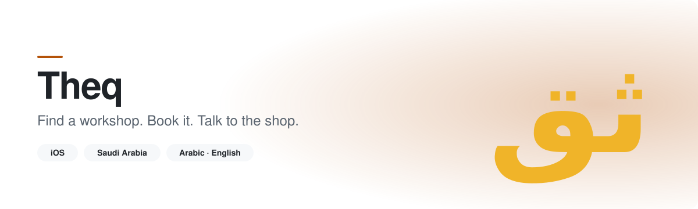
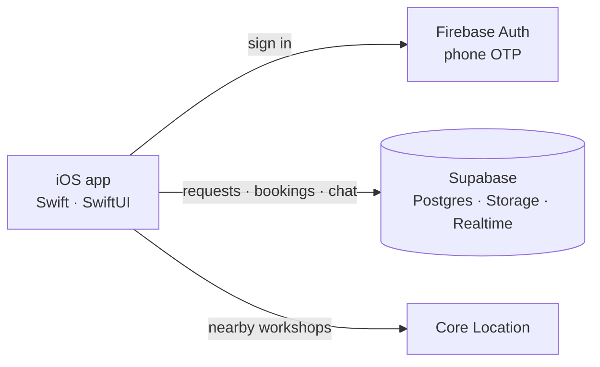

<picture>
  <source media="(prefers-color-scheme: dark)" srcset="assets/hero-dark.svg">
  
</picture>

**Theq (ثق)** is an iOS app for car owners in Saudi Arabia. Open it when something is wrong with your car, see the workshops nearby, describe the problem, book a time, and talk to the shop in the app until the job is done.

> ثق: اعثر على أقرب ورشة، احجز موعدك، وتواصل مع الورشة من داخل التطبيق.

  
  
  

## What it does

- **Nearby workshops.** Uses your location to list workshops around you with their distance.
- **Describe the problem.** Add your vehicle, say what's wrong, and send a service request.
- **Book a time.** Pick an appointment slot that suits you instead of calling around.
- **Talk to the shop.** Chat with the workshop in the app, from first question to pickup.
- **Arabic and English.** Full right-to-left support, not a translated afterthought.
- **Phone sign-in.** One-time SMS code, no passwords to remember.

## How it works

1. Sign in with your phone number.
2. Add your car and describe the issue.
3. Choose a nearby workshop and a time.
4. Chat with the shop and get notified as the job moves along.

<!--
  Screenshots: drop PNGs into assets/ and uncomment this block.
  Keep them free of real customer names, phone numbers, and plates.

## Screenshots

  
  
  
  

-->

## Under the hood

- **App:** Swift and SwiftUI, built for RTL from day one.
- **Auth:** Firebase phone authentication with SMS verification.
- **Data:** Supabase for vehicles, service requests, bookings, and chat.
- **Location:** Core Location for nearby workshops and distances.

## Privacy

Theq collects only what it needs to connect you with a workshop: your phone number, your vehicle details, the requests you send, and your location while you search. Data is handled under the Saudi Personal Data Protection Law. The app is for users 18 and over.

[Privacy policy](https://ibr4himm.github.io/theq-legal/) · [Support](https://ibr4himm.github.io/theq-legal/support.html)

## Source code

The source is private. This repository is the public home for the project: what it does, how it's built, and how to reach us.

## Contact

Questions, workshop partnerships, or beta access: **Theq2026@gmail.com**
